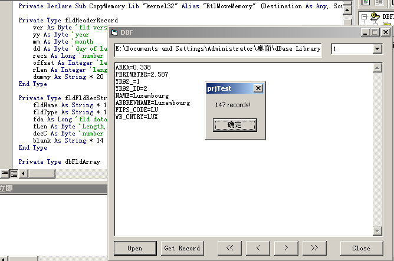



## updated v3 : ADO\-like OO class Read/Write dBase database file without any dll/ocx

### Description

This is an updated version to (http://www.planet-source-code.com/vb/scripts/ShowCode.asp?txtCodeId=53106&lngWId=1)

It is quite out of date:

1.I found it years ago;

2.it is first written in 1992 by Ethan Winer;

3. seldmom people use dBase nowadyas.

But I picked it up last night and decided to make it better: wrap it into a handy OO class, support for all

character-sets, tidy up all the codes that strictly follows the coding standard.

Changes:

2004/4/13 15:05 GMT-8

1.mimics part of the ADO mechanism(MoveFirst/MovePrevious/MoveTo/MoveNext/MoveLast/BOF/EOF)

2.State(Open/NotReady)

2004/4/14 09:55 GMT-8(v3)

1.all long types to support as more records as possible

2.built-in all field types
 
### More Info
 

             |
---                |---
**Submitted On**   |2003-01-02 15:37:30
**By**             |[enmity](https://github.com/Planet-Source-Code/PSCIndex/blob/master/ByAuthor/enmity.md)
**Level**          |Intermediate
**User Rating**    |5.0 (20 globes from 4 users)
**Compatibility**  |VB 4\.0 \(32\-bit\), VB 5\.0, VB 6\.0
**Category**       |[Databases/ Data Access/ DAO/ ADO](https://github.com/Planet-Source-Code/PSCIndex/blob/master/ByCategory/databases-data-access-dao-ado__1-6.md)
**World**          |[Visual Basic](https://github.com/Planet-Source-Code/PSCIndex/blob/master/ByWorld/visual-basic.md)
**Archive File**   |[updated\_v31733164132004\.zip](https://github.com/Planet-Source-Code/enmity-updated-v3-ado-like-oo-class-read-write-dbase-database-file-without-any-dll-ocx__1-53109/archive/master.zip)

